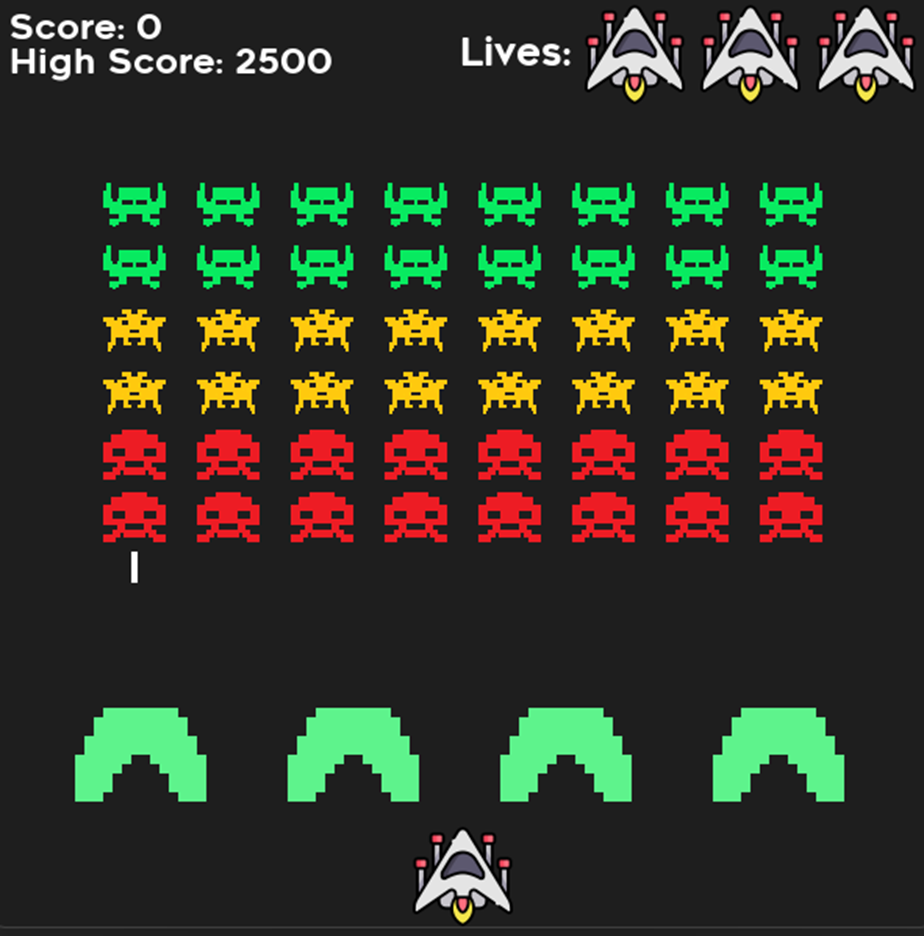
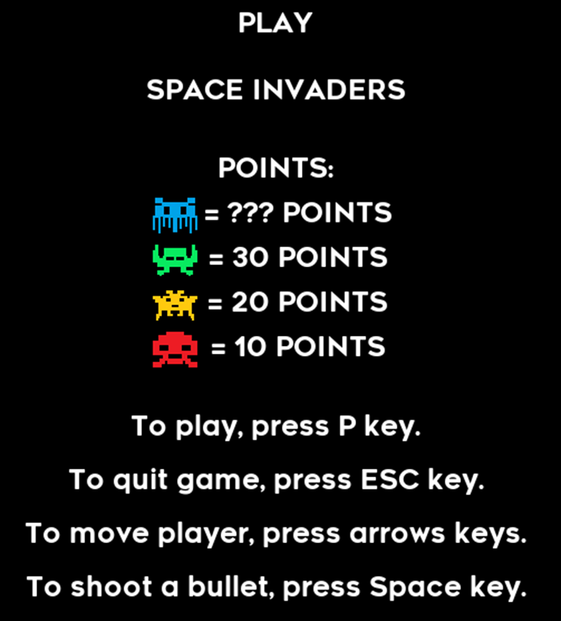

# 1) Introduction and Program Justification
Space Invaders is a game where the goal is to shoot down all aliens on the board, scoring as many points as possible. The game ends when the player loses all lives.

**Sample Board Look**

# 2) Program Description
The program starts by displaying a start screen with the text "Play Space Invaders" and a points list for shooting down each enemy. Below are the game controls instructions, explaining the actions of each key:
* „P” starts game,
* „ESC” turns off game in any moment,
* „$\leftarrow$” moves player to left,
* „$\rightarrow$” moves player to right,
* „Space” makes player shoot an bullet.

**Start Screen Look**

After starting the game, enemies and the player appear on the screen. Shooting down all enemies rewards the player with an extra life and starts the next round. A blue enemy appears sporadically during rounds, worth 100 points when shot down.
Failing to shoot down all enemies causes them to invade the player's territory, ending the game. A screen with the text "GAME OVER" then appears along with instructions for what to do next:
* Key „R” resets game,
* Key „ESC” turns off the game.

# 3) Module List
Files:
* code:
    * army.py
    * block.py
    * bullet.py
    * enemy.py
    * game.py
    * main.py
    * object.py
    * obstacles.py
    * player.py
    * scoreboard.py
    * secret_enemy.py
    * sounds.py

All methods within the classes are documented in comments.
# 4) Compilation
To run the game, you need Python compiler version 3.9 installed on your computer. Simply click on the Space_Invaders.exe file found in the code folder to start the game.

# 5) References
The project utilizes the following libraries and files:
* Libraries: 
    * pygame,
    * sys,
    * random.
* Files:
    * resourses:
        * font:
            * RenogareSoft-Regular.tff
        * images:
            * player.png
            * icon.png
            * 100.png
            * 30.png
            * 20.png
            * 10.png
        * sound:
            * player_explosion_sound.wav
            * player_death_sound.wav
            * obstacles_explosion_sound.wav
            * enemy_death_sound.wav
            * bullet_sound.wav
            * background_music.wav

Information about the sources of the above materials is located in the Credits.txt text files within the respective folders.
